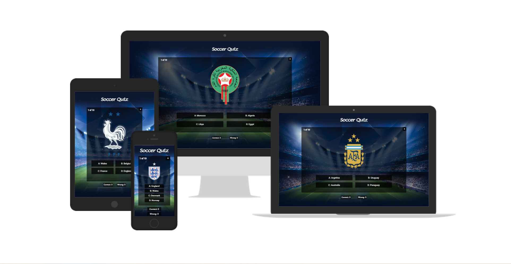

# Soccer Quiz

**Soccer quiz is a multiple choice quiz that will test your knowledge about national team emblems.**

***[Live website](https://dcigic92.github.io/pp2-soccer-quiz/)*** created by **Dino Cigic**.

***

## Credits

### Images 

- [Wikipedia](https://wikipedia.org/) - All logos taken from wikipedias national team pages.

- [Wallpapercave](https://wallpapercave.com/) 
    - [Image](https://wallpapercave.com/w/Mx8QOkb) by [kimberly8208](https://wallpapercave.com/u/kimberly8208) - Background photo

- [Flaticon](https://www.flaticon.com/)
    - [Image](https://www.flaticon.com/free-icon/ball_9985259) by [Mayor Icons](https://www.flaticon.com/authors/mayor-icons) - favicon

### Code

- A lot of html, css and js learned on [W3Schools](https://www.w3schools.com/).
- Some parts of code were inspired by Love Maths Walkthrough Project from [Code institute](https://learn.codeinstitute.net/dashboard).

## Acknowledgements

- My mentor **Akshat Garg** for his feedback and advice.
- Our cohort facilitator **Alan Bushell** and slack community.
- My wife and friends for testing the game.