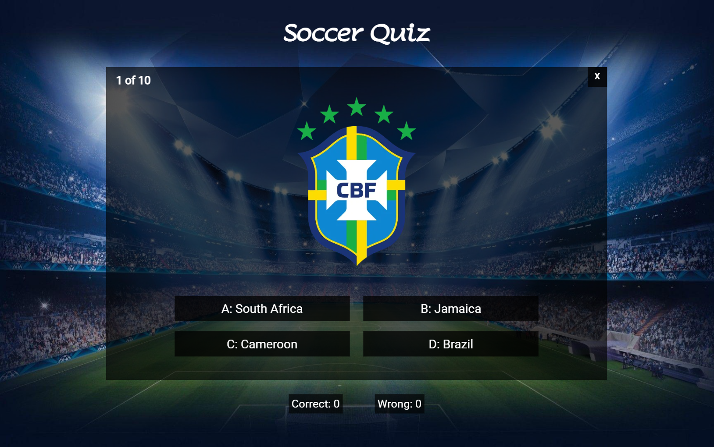
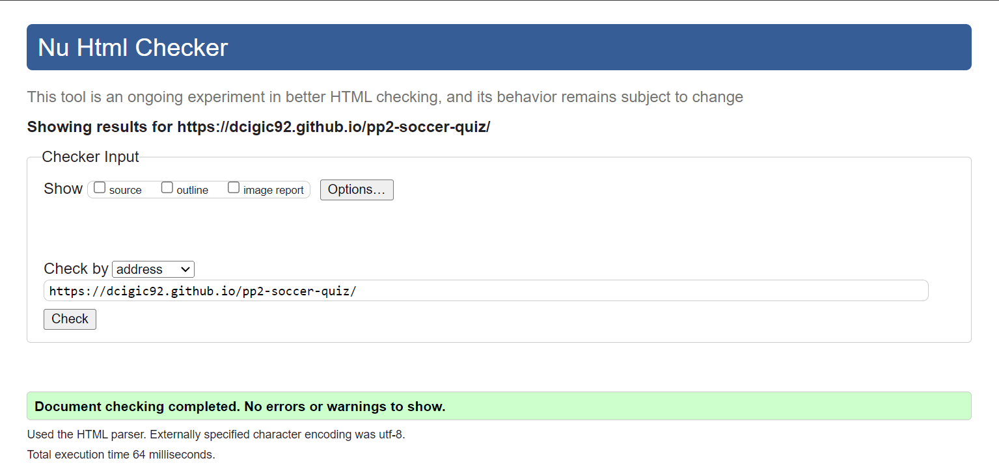

# Soccer Quiz

**Soccer quiz is a multiple choice quiz that will test your knowledge about national team emblems.**

***[Live website](https://dcigic92.github.io/pp2-soccer-quiz/)*** created by **Dino Cigic**.

***

## Contents

- [User experience](#user-experience)
    - [Project goals](#project-goals)
    - [User stories](#user-stories)
- [Design](#design)
    - [Colours](#colours)
    - [Typography](#typography)
    - [Site Structure](#site-structure)
- [Features](#features)
    - [Heading](#heading)
    - [Intro window](#intro-window)
    - [Game window](#game-window)
    - [Game over window](#game-over-window)
    - [Instructions window](#instructions-window)
    - [Highest score window](#highest-score-window)
    - [Features left to implement](#features-left-to-implement)
- [Technologies Used](#technologies-used)
- [Testing](#testing)
    - [Manual testing](#manual-testing)
    - [CSS Validation](#css-validation)
    - [HTML Validation](#html-validation)
    - [JS Validation](#js-validation)
    - [Google Lighthouse](#google-lighthouse)
    - [Resolved bugs/issues](#resolved-bugsissues)
    - [Unresolved bugs/issues](#unresolved-bugsissues)
- [Deployment](#deployment)
- [Credits](#credits)
    - [Images](#images)
    - [Code](#code)
- [Acknowledgements](#acknowledgements)

## User experience

### Project goals
- To create a fun and educational game .

### User stories
- As a user, I want to be able to easily navigate the page.
- As a user, I want to track questions.
- As a user, I want to track my score.
- As a user, I want to save my highest score.

## Design

### Colours
The background image gave me a lot of green and blue. I used only black color with different opacity levels and white color for the text.

### Typography
In this project I used google fonts. ***Lumanosimo*** font used for headings and ***Roboto*** font used for the body text.

### Site Structure
The website has only one html page and instead of more html pages using divs as windows. Showing and hiding different divs with help of css and javascript. It has 5 different windows and score tracking div which appears under the game window.

## Features

### Heading
- heading is always on the top of the page.

### Intro window
- Home/landing window with welcome message and 3 buttons.

### Game window
- Game window has question counter in the top left corner and exit button in the top right corner.
- Quiz question is random national team logo and under the question are 4 answer buttons.
- If selected button is correct answer, next 0.4 seconds will be green and if is wrong it will be red.
- Under the game window there are correct and wrong scores.

### Game over window
- Game over window has game over message and final score message.
- Under the final score message there is home button.

### Instructions window
- Instructions window has heading and list of instructions.
- Under the list there is home button.

### Highest score window
- Highest score window has heading and highest score saved.
- Under the score there is home button.

### Features left to implement
- More options like club logos, stadiums or soccer history questions.

## Technologies Used
- HTML
- CSS
- Javascript
- [Git](https://git-scm.com/)
- [Github](https://github.com/)
- [Visual Studio Code](https://code.visualstudio.com/)
- [W3Schools](https://www.w3schools.com/)
- [Stack Overflow](https://stackoverflow.com/)
- [Chrome DevTools](https://developer.chrome.com/docs/devtools/)
- [Google fonts](https://fonts.google.com/)
- [Favicon.io](https://favicon.io/)
- [Convertio.co](https://convertio.co/)
- [Am I responsive](https://amiresponsive.co.uk/)

## Testing

### Manual testing

- User testing
    - Tested by 4 persons to get some general feedback.

- Devices
    - Tested on 7 different devices.

- Browsers
    - Tested in Google Chrome, Firefox and Microsoft Edge.

- Responsiveness
    - Tested on all available devices in Chrome DevTools.

### CSS Validation
CSS code was validated with the W3C Jigsaw CSS Validation Service and no errors found.

    

### HTML Validation
HTML code was validated with the W3C Markup Validation Service and no errors found.

### JS Validation
Javascript code validated with JSHint, had few missing semicolons and a lot of warnings for using ***let*** and ***const***.

### Google Lighthouse

### Resolved bugs/issues

- Had issues with white space at the bottom of the page, the background did not cover the entire screen. Fixed it by adding ***background-size: cover*** and ***background: fixed***.

### Unresolved bugs/issues

- No unresolved issues.

## Deployment

To deploy the website I used GitHub pages and followed these steps:

1. Open your *repository*.
2. Click on *settings* in the *navigation menu*.
3. Under *code and automation* choose *pages*.
4. Select the *main branch* and *save*.
5. Refresh a few times and the link to your website should appear shortly.

## Credits

### Images 

- [Wikipedia](https://wikipedia.org/) - All logos taken from wikipedias national team pages.

- [Wallpapercave](https://wallpapercave.com/) 
    - [Image](https://wallpapercave.com/w/Mx8QOkb) by [kimberly8208](https://wallpapercave.com/u/kimberly8208) - Background photo

- [Flaticon](https://www.flaticon.com/)
    - [Image](https://www.flaticon.com/free-icon/ball_9985259) by [Mayor Icons](https://www.flaticon.com/authors/mayor-icons) - favicon

### Code

- A lot of html, css and js learned on [W3Schools](https://www.w3schools.com/).
- Some parts of code were inspired by Love Maths Walkthrough Project from [Code institute](https://learn.codeinstitute.net/dashboard).

## Acknowledgements

- My mentor **Akshat Garg** for his feedback and advice.
- Our cohort facilitator **Alan Bushell** and slack community.
- My wife and friends for testing the game.